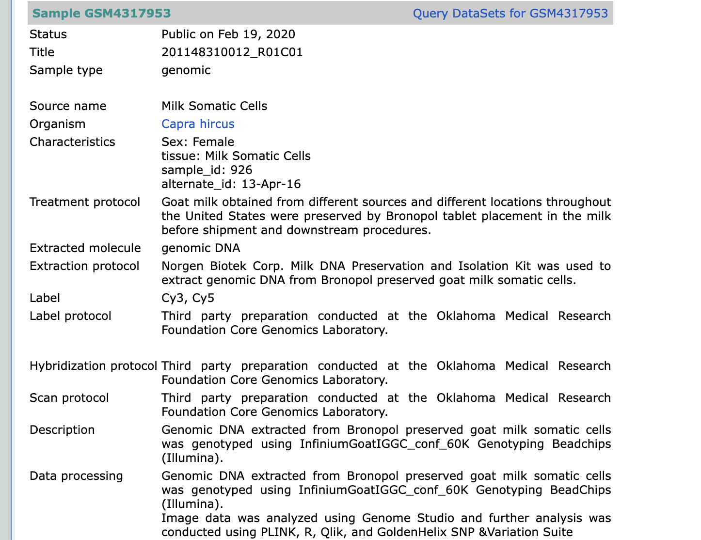

::: callout
## Outcomes
1- To identify what are metadata and its types
2- To memorize the community standards and how to use them for data and metadata
3- To define what is data provenance
:::

## Meta-data

Metadata is the description of your data.  In a simple words, if we had a data file such as an Excel spreadsheet containing data values for an assay, column headings are used to assign meaning and context.  Here the data itself are the data values, and the metadata are the column headings. Any documentation or explanation of the excel file that accompanies it, is likewise considered metadata.

As you can see in the following image,  the data are colored in orange which represents the heart rate, genotype and patient ID. In blue color, you can see the metadata which describe what is this data, (the name of the cohort, the contact e-mail for more information on the dataset.

{alt='alt text'}

#### What else would metadata reveal?
To understand what else metadata can describe, let's have a look again on the previous image, **what else would you like to add to understand the data more?**

Additional metadata for provenance and general descriptions can be added. More information about the cohort name, for example, is required because "Human Welsh Cohort" does not tell us much in comparison to other existing Welsh cohorts. Here, we would include a unique ID or working title for the cohort, as well as a project URL describing its origin and composition.

The column headings appear to be complete, though there are some issues with the data in orange. The diabetes status column appears to capture the disease's type and stage.
- In row 3, it is unclear whether the disease is Diabetes Mellitus or Diabetes Insipidus.
- In row 4, it is unclear whether the type of diabetes mellitus is 1 or 2.
- There is an empty space in the final row. It is unclear whether this is due to a lack of information or the patient does not have diabetes.
So to do this better, two separate columns are created for the type and stage of the disease. The disease's name included whether it was type 1 or type 2. You can check this in here 
{alt='alt text'}

**Building on the previous examples,** Metadata can demonstrate a variety of things, including your data's characteristics and data provenance, which explains how your data was created. There are three types of metadata: descriptive, structural, and administrative.  

- **Descriptive Metadata** describes the characteristics of the dataset so for instance authors, abstracts, and any relevant publication.
- **Structural metadata** describes how it is generated, and how it is internally structured.
- **Administrative metadata** describes who managed the data, collaborators and project funds.  

::: discussion
## Identify types of metadata in this microarray dataset
let’s see this example on microarray data from a database called arrayexpress. In this dataset, you will find the data, metadata, and persistent identifier (PID). In the black circle, you will find the data identifier (ID) which is unique and persistent to the data. For metadata, you will find the administrative metadata in the orange square. You will also find the descriptive metadata in the orange square, as you can see, it describes the author, publication and abstract for the study. For the structural metadata, it is described in the files (orange arrows). 
{alt='alt text'}
:::

:::::::::::::::::::::::::::::: challenge
- From the FAIRcoobook, can you find the recipe on how to create metadata profiles? you can start from (here)[https://faircookbook.elixir-europe.org/content/home.html]
:::::: solution
First of all, let's understand the structure of the FAIRCookbook. For a quick overview, you can watch our RDMBites on FAIRcookbook (here)[]

The building unit of FAIR cookbook is called a recipe, The recipe is the term used to describe instructions for how to FAIRify your data. As you see in the image, the structure of each recipe includes these main items:
1- Graphical overview which is the midmap for the recipe
2- Ingredients which gives you an idea for the skills needed and tools you can use to apply the recipes
3- The steps and the process
4- Recommendations of what to read next and references to your reading

So let's use the search box and write down metadata profiles

As you see the results comes up, choose metdata profiles

As we explained earlier the recipe shows necessary steps for  creating metadata profiles

:::::::::::::::::::::::::::::::::::::::
### Data and metadata should follow Community standards
Each data type has its own community that creates criteria to ensure that metadata and data are described appropriately. When describing your data, make sure to adhere to the community standards. This is critical as your data becomes more trustworthy. If you decide to utilise other criteria, make sure you document this clearly. The use of community standards will not only allow your data to be reused, but it will also be easily interoperable across multiple platforms.
We provide samples of various community standards that you may use to ensure that your data is described using the right descriptors. 

::: challenge
## Exercise
RDMkit provides a nice domain specific-training[here](https://rdmkit.elixir-europe.org/your_domain), what is the name of community standard for bioimage?

- you can start from here
- As you see in this picture the structure of rdmkit is as follows

- 
:::

### Provenance

**Provenance** is the detailed description of the history of the data and how it is generated.
Here is an example from GEO database where there is accurate description of the data which allow the reusability of microarray data. As you see, there is rich description of the study design, organism, platform and description of data. The user can reuse the data safely as the decryption of the data and metadata allows accurate reusability of the data. Also, attachment to this dataset, there are files that allow machine readability of these metadata that can be read by software packages like R.
{alt='alt text'}

### Vocabularies are FAIR
The metadata and data should be described by vocabularies that comply with FAIR which means that metadata and data should be:
**F** globally unique and persistent identifiers                           
**A** accessible documentation that extensively describes your identifiers
**I** Vocabularies are interoperable
**R** Can be reused and interpreted easily by humans and machines

### Linked metadata
When uploading your dataset to any database, you should include the following information:
1- Additional datasets that supplement your data
2- It should be stated if your dataset is built on another dataset.

### Metadata and data are always available
The maintenance of the data sets in the public database comes at a cost. This can be avoided by maintenance of the metadata instead. Metadata is small and can be easily maintained not only on the database but personal computer of researchers. This also the case for sensitive data where the metadata are available and provides contact details of the researchers, how to get the data and data provenance

::::::::::::::::::::::::: challenge
- After reading previous resources, you should have an idea on metadata, would you give an example of metadata without data?
:::::::::solution

:::::::::::::::::::::::::

Usually, when the data is generated, both metadata and data files are separate files. As a researcher, you should ensure that both files refer to each other.

::::::::::: challenge
- Can you extract data provenance from this data set [E-MTAB-7933](https://www.ebi.ac.uk/biostudies/arrayexpress/studies/E-MTAB-7933)? 
::::::::::::::::

::: callout
## Resources
You can learn more about how to describe your data using FAIR vocabularies and formal language for knowledge representation from the following:
- Recipe from the FAIRCookbook on[FAIR and the notion of metadata](https://faircookbook.elixir-europe.org/content/recipes/introduction/metadata-fair.html)
- RDMkit explanation of machine readability[Machine readability](https://rdmkit.elixir-europe.org/machine_actionability)
- Read more about vocabularies and ontologies from 
- [Vocabularies and ontology](https://carpentries-incubator.github.io/fair-bio-practice/06-being-precise/index.html)
- [List of ontologies](https://obofoundry.org/)
- This is a nice introduction to metadata from Ed-DaSH carpentries course [Introduction to metadata](https://carpentries-incubator.github.io/fair-bio-practice/05-intro-to-metadata/index.html) 
- The following recipe from the FAIRCookbook provides instructions on how to create metadata profiles[Metadata profiles](https://faircookbook.elixir-europe.org/content/recipes/interoperability/creating-minimal-metadata-profiles.html): 
- RDMkit explanation on how to manage metadata: [Metadata management](https://rdmkit.elixir-europe.org/metadata_management.html)
- [Domain specific repositories](https://carpentries-incubator.github.io/fair-bio-practice/13-data-repositories/index.html): This is a lesson on types of repositories and give examples on domain specific repositories
- ED-DaSH lesson on how to choose a data repository [How do we choose a research data repository?](https://carpentries-incubator.github.io/fair-bio-practice/13-data-repositories/index.html)
- FAIRsharing provided a great information on writing domain specific metadata, you can find it [here](https://fairsharing.org/searchfairsharingRegistry=Standard&subjects=life%2520science&page=1)
- A recipe from the FAIRcookbook on how to [Interlink data from different sources](https://faircookbook.elixir-europe.org/content/recipes/interoperability/identifier-mapping.html#references)
- A nice guideline on [How can you record data provenance](https://rdmkit.elixir-europe.org/data_provenance)
- FAIRcookbook recipe on [Audit of the provenence process](https://faircookbook.elixir-europe.org/content/recipes/reusability/provenance.html)
:::

::: checklist
### FAIR principles
This episode covers the following principles:
(I2)  (meta)data use vocabularies that follow FAIR principles
(I1)  (meta)data use a formal, accessible, shared, and broadly applicable language for knowledge representation
(I3)  (meta)data include qualified references to other (meta)data
(A2) Metadata are accessible, even when the data are no longer available**
:::
